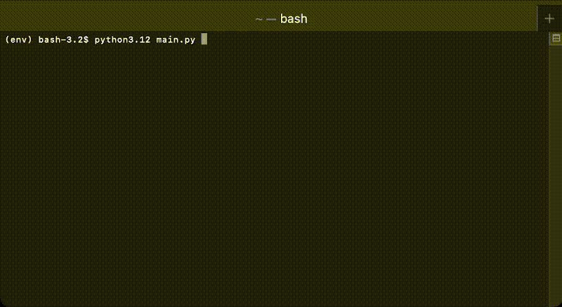

# Web-Scraper-Weather

A terminal weather app that scrapes public weather data from weather.gov and processes it using beautifulsoup4.
For quick access to coordinates to use with the app, I recommend using https://www.latlong.net/

